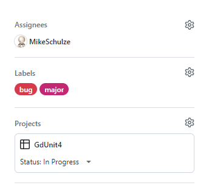
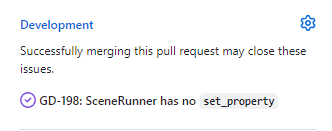

# Contributing to GdUnit4

**Thank you for considering contributing to GdUnit4!** 
We appreciate your input and want to make the contribution process as easy and transparent as possible.
Whether you want to report a bug, discuss code improvements, submit a fix, propose new features, or become a maintainer,
we welcome your involvement.

## Reporting Bugs

If you encounter any bugs or issues, please use GitHub's issue tracking system. You can report a bug by [opening a new issue](https://github.com/MikeSchulze/gdUnit4/issues/new?assignees=MikeSchulze&labels=bug&projects=projects%2F5&template=bug_report.yml&title=GD-XXX%3A+Describe+the+issue+briefly).
When submitting a bug report, please provide detailed information, including the steps to reproduce the issue, relevant background information,
and sample code if possible.

## Development on GitHub

We use GitHub to host our code, track issues and feature requests, and accept pull requests.
We follow the <a href='https://docs.github.com/en/get-started/quickstart/github-flow' target="_blank">GitHub Flow</a> for making code changes.
This means that all code modifications should be proposed through pull requests. Pull requests provide a structured and collaborative way to
review and discuss code changes.

**If you'd like to contribute, please follow these steps:**

1. Select an open issue to work on or create a new issue if none exists.
   - Assign the issue to yourself and set its status to "In Progress." 
   
2. Fork the repository and create a branch from the `master` branch.
   - Use the issue number as the branch name, e.g., GD-111.
3. If you have made changes to the code that should be tested, please include appropriate tests.
4. If you have implemented new features or modified any APIs, ensure that the documentation is updated accordingly.
5. Create a pull request and provide information in the "Why" and "What" sections:
   - Link the pull request to the corresponding issue. 
   
   - Assign the pull request to yourself.
   - Make sure each pull request is associated with only one issue.
   - If the pull request is still in progress, mark it as a draft.
   - Ensure your code follows the [Coding Style](#coding-style) conventions
   - Ensure that the continuous integration (CI) process passes successfully.
6. Submit the pull request!

## Pull Request Rules

To ensure a smooth review process, every Pull Request (PR) must meet the following criteria:

1. Naming & Linking
   - PR Title: Must start with the issue number followed by a concise summary:
     e.g., GD-1234: Add support for multithreaded test execution
   - Branch Naming: Start with the issue number (e.g., GD-1234 or GD-1234-feature-name).
     Link Issue: Every PR must be linked to a single corresponding issue.
2. Content & Style
   - Grammar: Both the title and description must be written in the present tense (e.g., "Add feature" instead of "Added feature").
   - Required Sections: The PR description must include:
     - **# Why** - A clear explanation of the need for this change.
     - **# What** - A detailed description of the changes and their effects.
   - Scope: Keep changes minimal and focused. Include documentation updates where applicable.

### AI Usage

The use of AI is permitted, but you remain fully responsible for your contributions.

- Follow the project-specific rules defined in the claude files: [CLAUDE.md](./CLAUDE.md).
- Never commit AI-generated code without understanding it yourself
- Avoid unnecessary class or function documentation when names are already self-explanatory

## Project Setup

Most contributions can be made using the standard (non-Mono) Godot version.  
C# support is only required when working on the C# API.

### Prerequisites

You should be comfortable with:

- Basic Godot usage (scenes, nodes, scripts, etc...)
- Reading and writing simple GDScript
- Basic Git workflow

### Compatibility & Supported Versions

All contributions must be compatible with the Godot versions currently supported by this project:

- **Target Versions:** Please refer to the [Compatibility Overview](./README.md#compatibility-overview) for the list of supported Godot versions on the master branch.
- **Verification:** You are responsible for ensuring that your changes are fully functional across these versions.
- **Testing:** We recommend testing your changeset locally in the oldest and newest supported versions listed to avoid compatibility regressions.

### C# Setup - (Optional)

To contribute to the C# API, additional settings are required.

- Use a correct Godot **Mono build version** specified in [README.MD](./README.md#compatibility-overview)d)
- Install the .NET SDK version specified in [global.json](./global.json)

[.NET installation instructions](https://learn.microsoft.com/en-us/dotnet/core/install/)

#### Verify your setup

Check the SDK(s) is installed on your system:  
`dotnet --list-sdks`

Build the C# project:  
`dotnet build`

The terminal should print "Build succeeded".
If Godot shows a generic error such as:  
`Build error: Failed to build project. Check MSBuild panel for details.`  
This can occur due to CI rules. Check the terminal output for details and ensure your changes comply with them.

For more details, refer to the GdUnit4Net repository.

### Setup GDScript Linting

GDScript linting uses `gdtoolkit` (`gdlint`).

[Install GDlint](https://github.com/Scony/godot-gdscript-toolkit)

You can optionally run `gdlint` locally to check your changes before submitting a PR.  
Linting is enforced by CI.

### Project Structure

For a high-level overview of the repository, see:

- [llms.txt](./llms.txt)
- [llms-full.txt](./llms-full.txt)

To help AI tools like ChatGPT or Claude provide more accurate answers about our project, we offer optimized formats:
Why? Standard websites contain too much "noise" (menus, layouts) for AI. Our files provide clean, structured content for maximum precision and lower token usage.
Why the name? The naming follows the emerging standard for Large Language Models (LLMs). Similar to robots.txt for search engines, the llms prefix signals
that these files are specifically designed for AI consumption.
In short: We eliminate the clutter so the AI can find the right answers faster.

### Notes for contributors

- Basic understanding of object-oriented concepts (interfaces, inheritance) is recommended
- C# knowledge is helpful but not required for GDScript-only contributions
- The goal is to apply linting across the entire project, but currently only part of the source tree is fully lint-clean
- Please follow existing project rules and CI expectations for the files you modify
- Never commit changes to `project.godot` unless we need to update the C# API dependencies
- Follow the repository configuration and formatting rules defined in files such as [.gdlintrc](./.gdlintrc), [.editorconfig](./.editorconfig),
  [.markdownlint.jsonc](./.github/actions/formatting_checks/.markdownlint.jsonc), and [.yamllint.yml](./.github/actions/formatting_checks/.yamllint.yml)

## License

By contributing to this project, you agree that your contributions will be licensed under the same
<a href='https://github.com/MikeSchulze/gdUnit4/blob/master/LICENSE' target="_blank">MIT License</a> that covers the project.
If you have any concerns, please reach out to the maintainers.

## Coding Style

To maintain code consistency, please adhere to the following coding style guides:

- <a href='https://docs.godotengine.org/en/stable/tutorials/scripting/gdscript/gdscript_styleguide.html' target="_blank">Godot's GDScript Conventions</a>
- <a href='https://docs.microsoft.com/en-us/dotnet/csharp/fundamentals/coding-style/coding-conventions' target="_blank">C# Coding Conventions</h>
